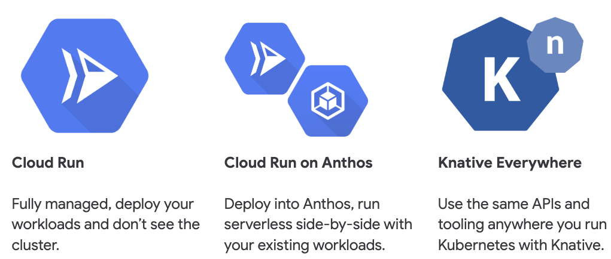
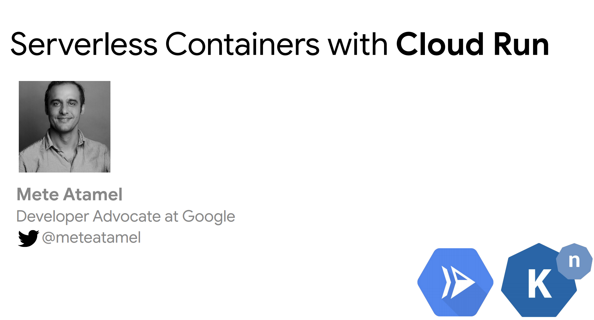

# Cloud Run Tutorial



[Cloud Run](https://cloud.google.com/run/) is a managed serverless platform that enables you to run stateless containers invocable via HTTP requests on Google Cloud.

Cloud Run is built from open-source [Knative](https://knative.dev/), letting you choose to run your containers either fully managed with Cloud Run, or in your Google Kubernetes Engine cluster with Cloud Run on Anthos, or use Knative on any Kubernetes cluster running anywhere.

## Slides
There's a [presentation](https://speakerdeck.com/meteatamel/serverless-containers-with-cloud-run) that accompanies the tutorial.

[](https://speakerdeck.com/meteatamel/serverless-containers-with-cloud-run)

## Setup

[Cloud Run](https://cloud.google.com/run/) is a fully managed service, so there's no setup other than enabling Cloud Run and Cloud Build. [Cloud Run for Anthos](https://cloud.google.com/run/docs/quickstarts/prebuilt-deploy-gke) requires Anthos. This tutorial focuses on managed Cloud Run. 

To enable Cloud Build and Cloud Run:

```bash
gcloud services enable --project ${PROJECT_ID} \
    cloudbuild.googleapis.com \
    run.googleapis.com
```

## Samples

* [Public service](docs/public.md)
* [Configure](docs/configure.md)
* [Private service](docs/private.md)
* [Pub/Sub triggered service](docs/pubsub.md)
* [Scheduled service](docs/scheduled.md)
* [Task triggered service](docs/task.md)

-------

This is not an official Google product.
