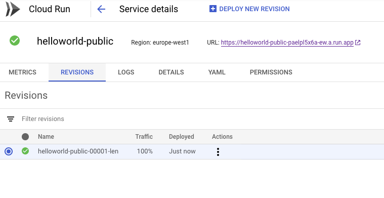

# Hello World Cloud Run

In this tutorial, we will deploy a container to Cloud Run.

## Create a 'Hello World' service

Cloud Run already has a [build-and-deploy](https://cloud.google.com/run/docs/quickstarts/build-and-deploy) page that shows how to deploy a `Hello World` service in various languages. 

You can either create your 'Hello World' service as described in Cloud Run docs or take a look at the service we already created in [helloworld-csharp](../helloworld-csharp/) folder.

## Build the container

In folder where `Dockerfile` resides, build the container using Cloud Build and push it to Container Registry:

```bash
gcloud builds submit \
  --project ${PROJECT_ID} \
  --tag gcr.io/${PROJECT_ID}/helloworld
```

## Deploy to Cloud Run

```bash
gcloud beta run deploy \
  --image gcr.io/${PROJECT_ID}/helloworld \
  --platform managed \
  --allow-unauthenticated
```
This creates a Cloud Run service and a revision for the current configuration. In the end, you get a url that you can browse to.

## Test the service

You can test the service by visiting the url mentioned during deployment and in Cloud Run console. 

You can also see the service in Cloud Run console:



## What's Next?

[Configure service](02-configureservice.md)
