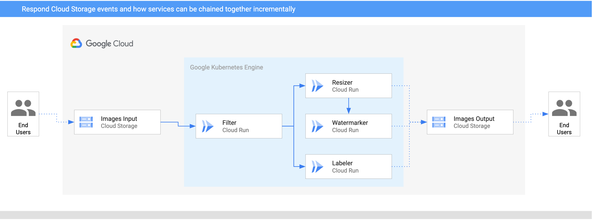

# Image Processing Pipeline - GKE

In this sample, we'll build an image processing pipeline to connect Google Cloud
Storage events to various services with **Events with Cloud Run on GKE**.



1. An image is saved to an input Cloud Storage bucket.
2. Cloud Storage update event is read into Cloud Run via `CloudStorageSource`.
3. Filter service receives the Cloud Storage event. It uses Vision API to
   determine if the image is safe. If so, it creates a custom `CloudEvent` of
   type `dev.knative.samples.fileuploaded` and passes it onwards.
4. Resizer service receives the `fileuploaded` event, resizes the image using
   [ImageSharp](https://github.com/SixLabors/ImageSharp) library, saves to the
   resized image to the output bucket, creates a custom `CloudEvent` of type
   `dev.knative.samples.fileresized` and passes the event onwards.
5. Watermark service receives the `fileresized` event, adds a watermark to the
   image using [ImageSharp](https://github.com/SixLabors/ImageSharp) library and
   saves the image to the output bucket.
6. Labeler receives the `fileuploaded` event, extracts labels of the image with
   Vision API and saves the labels to the output bucket.

## Prerequisites

Events for Cloud Run is currently private alpha. We're assuming that you already
have your project white listed
[here](https://sites.google.com/corp/view/eventsforcloudrun), read the [Complete
User
Guide](https://docs.google.com/document/d/16UHFfDQJlpFb1WsrPZ-DYEP8_HcLbbRPK1ScACXct6U/edit)
for `Events for Cloud Run - GKE` and setup a GKE cluster with Cloud Run Events
installed as described in the guide.

If everything is setup correctly, you should see pods running in
`cloud-run-events` and `knative-eventing` namespaces and a `Broker` in the
default namespace:

```bash
kubectl get pods -n cloud-run-events
kubectl get pods -n knative-eventing
kubectl get broker
```

You should also set some variables to hold your cluster name and zone. For
example:

```bash
export CLUSTER_NAME=events-cluster
export CLUSTER_ZONE=europe-west1-b

gcloud config set run/cluster ${CLUSTER_NAME}
gcloud config set run/cluster_location ${CLUSTER_ZONE}
gcloud config set run/platform gke
```

## Create storage buckets

Create 2 unique storage buckets to save pre and post processed images:

```bash
export BUCKET1="$(gcloud config get-value core/project)-images-input"
export BUCKET2="$(gcloud config get-value core/project)-images-output"
gsutil mb -p $(gcloud config get-value project) \
   -l $(gcloud config get-value run/region) \
   gs://${BUCKET1}
gsutil mb -p $(gcloud config get-value project) \
   -l $(gcloud config get-value run/region) \
   gs://${BUCKET2}
```

## Enable Vision API

Some services use Vision API. Make sure the Vision API is enabled:

```bash
gcloud services enable vision.googleapis.com
```

## Filter

This service receives Cloud Storage events for saved images. It uses Vision API
to determine if the image is safe. If so, it passes a custom event onwards.

### Service

The code of the service is in
[filter](https://github.com/meteatamel/knative-tutorial/tree/master/eventing/image-processing-pipeline/filter)
folder.

Inside the folder where [Dockerfile](https://github.com/meteatamel/knative-tutorial/blob/master/eventing/image-processing-pipeline/filter/csharp/Dockerfile) resides, build and save the container
image:

```bash
export SERVICE_NAME=filter
docker build -t gcr.io/$(gcloud config get-value project)/${SERVICE_NAME}:v1 -f ${SERVICE_NAME}/csharp/Dockerfile .
docker push gcr.io/$(gcloud config get-value project)/${SERVICE_NAME}:v1
```

Deploy the service:

```bash
gcloud run deploy ${SERVICE_NAME} \
  --image gcr.io/$(gcloud config get-value project)/${SERVICE_NAME}:v1 \
  --update-env-vars BUCKET=${BUCKET1}
```

### Trigger

The trigger of the service filters on Cloud Storage finalize events:
`com.google.cloud.storage.object.finalize`.

Create the trigger:

```bash
gcloud alpha events triggers create trigger-${SERVICE_NAME} \
--target-service=${SERVICE_NAME} \
--type=com.google.cloud.storage.object.finalize \
--parameters bucket=${BUCKET1}
```

## Resizer

This service receives the custom event, resizes the image using
[ImageSharp](https://github.com/SixLabors/ImageSharp) library and passes the
event onwards.

### Service

The code of the service is in [resizer](https://github.com/meteatamel/knative-tutorial/tree/master/eventing/image-processing-pipeline/resizer)
folder.

Inside the folder where [Dockerfile](https://github.com/meteatamel/knative-tutorial/tree/master/eventing/image-processing-pipeline/resizer/csharp/Dockerfile) resides, build and save the container
image:

```bash
export SERVICE_NAME=resizer
docker build -t gcr.io/$(gcloud config get-value project)/${SERVICE_NAME}:v1 -f ${SERVICE_NAME}/csharp/Dockerfile .
docker push gcr.io/$(gcloud config get-value project)/${SERVICE_NAME}:v1
```

Deploy the service:

```bash
gcloud run deploy ${SERVICE_NAME} \
  --image gcr.io/$(gcloud config get-value project)/${SERVICE_NAME}:v1 \
  --update-env-vars BUCKET=${BUCKET2}
```

### Trigger

The trigger of the service filters on `dev.knative.samples.fileuploaded` event
types which is the custom event type emitted by the filter service.

Create the trigger:

```bash
gcloud alpha events triggers create trigger-${SERVICE_NAME} \
--target-service ${SERVICE_NAME} \
--type=dev.knative.samples.fileuploaded \
--custom-type
```

## Watermark

This service receives the event, adds the watermark to the image using
[ImageSharp](https://github.com/SixLabors/ImageSharp) library and saves the
image to the output bucket.

### Service

The code of the service is in [watermarker](https://github.com/meteatamel/knative-tutorial/tree/master/eventing/image-processing-pipeline/watermarker)
folder.

Inside the folder where [Dockerfile](https://github.com/meteatamel/knative-tutorial/tree/master/eventing/image-processing-pipeline/watermarker/csharp/Dockerfile) resides, build and save the container
image:

```bash
export SERVICE_NAME=watermarker
docker build -t gcr.io/$(gcloud config get-value project)/${SERVICE_NAME}:v1 -f ${SERVICE_NAME}/csharp/Dockerfile .
docker push gcr.io/$(gcloud config get-value project)/${SERVICE_NAME}:v1
```

Deploy the service:

```bash
gcloud run deploy ${SERVICE_NAME} \
  --image gcr.io/$(gcloud config get-value project)/${SERVICE_NAME}:v1 \
  --update-env-vars BUCKET=${BUCKET2}
```

### Trigger

The trigger of the service filters on `dev.knative.samples.fileresized` event
types which is the custom event type emitted by the resizer service.

Create the trigger:

```bash
gcloud alpha events triggers create trigger-${SERVICE_NAME} \
--target-service=${SERVICE_NAME} \
--type=dev.knative.samples.fileresized \
--custom-type
```

## Labeler

Labeler receives the event, extracts labels of the image with Vision API and
saves the labels to the output bucket.

### Service

The code of the service is in [labeler](https://github.com/meteatamel/knative-tutorial/tree/master/eventing/image-processing-pipeline/labeler)
folder.

Inside the folder where [Dockerfile](https://github.com/meteatamel/knative-tutorial/tree/master/eventing/image-processing-pipeline/labeler/csharp/Dockerfile) resides, build and save the container
image:

```bash
export SERVICE_NAME=labeler
docker build -t gcr.io/$(gcloud config get-value project)/${SERVICE_NAME}:v1 -f ${SERVICE_NAME}/csharp/Dockerfile .
docker push gcr.io/$(gcloud config get-value project)/${SERVICE_NAME}:v1
```

Deploy the service:

```bash
gcloud run deploy ${SERVICE_NAME} \
  --image gcr.io/$(gcloud config get-value project)/${SERVICE_NAME}:v1 \
  --update-env-vars BUCKET=${BUCKET2}
```

### Trigger

The trigger of the service filters on `dev.knative.samples.fileuploaded` event
types which is the custom event type emitted by the filter service.

Create the trigger:

```bash
gcloud alpha events triggers create trigger-${SERVICE_NAME} \
--target-service ${SERVICE_NAME} \
--type=dev.knative.samples.fileuploaded \
--custom-type
```

## Test the pipeline

Before testing the pipeline, make sure all the triggers are ready:

```bash
gcloud alpha events triggers list

   TRIGGER              EVENT TYPE                                TARGET
✔  trigger-filter       com.google.cloud.storage.object.finalize  filter
✔  trigger-labeler      dev.knative.samples.fileuploaded          labeler
✔  trigger-resizer      dev.knative.samples.fileuploaded          resizer
✔  trigger-watermarker  dev.knative.samples.fileresized           watermarker
```

You can upload an image to the input storage bucket:

```bash
gsutil cp ../pictures/beach.jpg gs://${BUCKET1}
```

After a minute or so, you should see resized, watermarked and labelled image in
the output bucket:

```bash
gsutil ls gs://${BUCKET2}

gs://events-atamel-images-output/beach-400x400-watermark.jpeg
gs://events-atamel-images-output/beach-400x400.png
gs://events-atamel-images-output/beach-labels.txt
```
