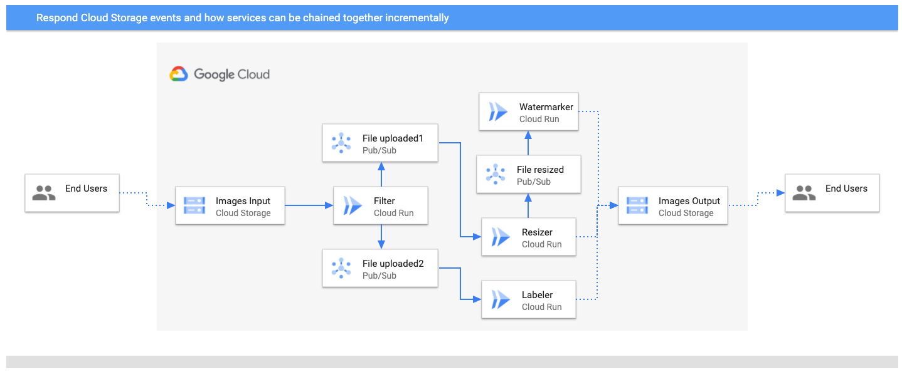

# Image Processing Pipeline

In this sample, we'll build an image processing pipeline to connect Google Cloud
Storage events to various services with **Events with Cloud Run (Managed)**.



1. An image is saved to an input Cloud Storage bucket.
2. Cloud Storage update event is read into Cloud Run via Audit Logs.
3. Filter service receives the Cloud Storage event. It uses Vision API to
   determine if the image is safe. If so, it creates sends a Pub/Sub message to
   `fileuploaded` topic.
4. Resizer service receives the event from `fileuploaded` topic, resizes the
   image using [ImageSharp](https://github.com/SixLabors/ImageSharp) library,
   saves to the resized image to the output bucket, sends a Pub/Sub message to
   `fileresized` topic.
5. Watermark service receives the event from `fileresized` topic, adds a
   watermark to the image using
   [ImageSharp](https://github.com/SixLabors/ImageSharp) library and saves the
   image to the output bucket.
6. Labeler receives the event from `fileuploaded` topic, extracts labels of the
   image with Vision API and saves the labels to the output bucket.

## Prerequisites

Events for Cloud Run is currently private alpha. We're assuming that you already
have your project white listed
[here](https://sites.google.com/corp/view/eventsforcloudrun), read the [Complete
User
Guide](https://drive.google.com/open?authuser=0&id=1cgvoMFzcVru_GbzNbZzxKCrKhw4ZJn4xdj2F0Q9pNx8)
for `Events for Cloud Run`.

You should also set some variables to hold your cluster name and zone. For
example:

```bash
export REGION=europe-west1

gcloud config set run/region $REGION
gcloud config set run/platform managed
```

## Create storage buckets

Create 2 unique storage buckets to save pre and post processed images. Make sure
the bucket is in the same region as your Cloud Run service:

```bash
export BUCKET1="$(gcloud config get-value core/project)-images-input"
export BUCKET2="$(gcloud config get-value core/project)-images-output"
gsutil mb -p $(gcloud config get-value project) \
   -l $(gcloud config get-value run/region) \
   gs://${BUCKET1}
gsutil mb -p $(gcloud config get-value project) \
   -l $(gcloud config get-value run/region) \
   gs://${BUCKET2}
```

## Create Pub/Sub topics

Create 2 Pub/Sub topics for intra-service communication:

```bash
export TOPIC1=fileuploaded
export TOPIC2=fileresized
gcloud pubsub topics create ${TOPIC1}
gcloud pubsub topics create ${TOPIC2}
```

## Enable Vision API

Some services use Vision API. Make sure the Vision API is enabled:

```bash
gcloud services enable vision.googleapis.com
```

## Filter

This service receives Cloud Storage events for saved images. It uses Vision API
to determine if the image is safe. If so, it passes a custom event onwards.

### Service

The code of the service is in
[filter](https://github.com/meteatamel/cloudrun-tutorial/tree/master/eventing/image-processing-pipeline/filter)
folder.

Inside the top level
[image-processing-pipeline](https://github.com/meteatamel/knative-tutorial/blob/master/eventing/image-processing-pipeline/)
folder, build and push the container:
image:

```bash
export SERVICE_NAME=filter
docker build -t gcr.io/$(gcloud config get-value project)/${SERVICE_NAME}:managed -f ${SERVICE_NAME}/csharp/Dockerfile .
docker push gcr.io/$(gcloud config get-value project)/${SERVICE_NAME}:managed
```

Deploy the service:

```bash
gcloud run deploy ${SERVICE_NAME} \
  --image gcr.io/$(gcloud config get-value project)/${SERVICE_NAME}:managed \
  --update-env-vars PROJECT_ID=$(gcloud config get-value project) \
  --allow-unauthenticated
```

### Trigger

The trigger of the service filters on Audit Logs for Cloud Storage events with
`methodName` of `storage.objects.create`.

Create the trigger:

```bash
gcloud alpha events triggers create trigger-${SERVICE_NAME} \
--target-service=${SERVICE_NAME} \
--type com.google.cloud.auditlog.event \
--parameters serviceName=storage.googleapis.com \
--parameters methodName=storage.objects.create \
--parameters resourceName=projects/_/buckets/${BUCKET1}
```

## Resizer

This service receives the event from `fileuploaded` topic, resizes the image using
[ImageSharp](https://github.com/SixLabors/ImageSharp) library and passes the
event onwards.

### Service

The code of the service is in [resizer](https://github.com/meteatamel/cloudrun-tutorial/tree/master/eventing/image-processing-pipeline/resizer)
folder.

Inside the top level
[image-processing-pipeline](https://github.com/meteatamel/cloudrun-tutorial/blob/master/eventing/image-processing-pipeline/)
folder, build and push the container:
image:

```bash
export SERVICE_NAME=resizer
docker build -t gcr.io/$(gcloud config get-value project)/${SERVICE_NAME}:managed -f ${SERVICE_NAME}/csharp/Dockerfile .
docker push gcr.io/$(gcloud config get-value project)/${SERVICE_NAME}:managed
```

Deploy the service:

```bash
gcloud run deploy ${SERVICE_NAME} \
  --image gcr.io/$(gcloud config get-value project)/${SERVICE_NAME}:managed \
  --update-env-vars PROJECT_ID=$(gcloud config get-value project), BUCKET=${BUCKET2} \
  --allow-unauthenticated
```

### Trigger

The trigger of the service filters on `fileuploaded` Pub/Sub topic.

Create the trigger:

```bash
gcloud alpha events triggers create trigger-${SERVICE_NAME} \
--target-service ${SERVICE_NAME} \
--type com.google.cloud.pubsub.topic.publish \
--parameters topic=${TOPIC1}
```

## Watermark

This service receives the event, adds the watermark to the image using
[ImageSharp](https://github.com/SixLabors/ImageSharp) library and saves the
image to the output bucket.

### Service

The code of the service is in [watermarker](https://github.com/meteatamel/cloudrun-tutorial/tree/master/eventing/image-processing-pipeline/watermarker)
folder.

Inside the top level
[image-processing-pipeline](https://github.com/meteatamel/cloudrun-tutorial/blob/master/eventing/image-processing-pipeline/)
folder, build and push the container:
image:

```bash
export SERVICE_NAME=watermarker
docker build -t gcr.io/$(gcloud config get-value project)/${SERVICE_NAME}:managed -f ${SERVICE_NAME}/csharp/Dockerfile .
docker push gcr.io/$(gcloud config get-value project)/${SERVICE_NAME}:managed
```

Deploy the service:

```bash
gcloud run deploy ${SERVICE_NAME} \
  --image gcr.io/$(gcloud config get-value project)/${SERVICE_NAME}:managed \
  --update-env-vars BUCKET=${BUCKET2} \
  --allow-unauthenticated
```

### Trigger

The trigger of the service filters on `fileresized` Pub/Sub topic.

Create the trigger:

```bash
gcloud alpha events triggers create trigger-${SERVICE_NAME} \
--target-service ${SERVICE_NAME} \
--type com.google.cloud.pubsub.topic.publish \
--parameters topic=${TOPIC2}
```

## Labeler

Labeler receives the event, extracts labels of the image with Vision API and
saves the labels to the output bucket.

### Service

The code of the service is in [labeler](https://github.com/meteatamel/knative-tutorial/tree/master/eventing/image-processing-pipeline/labeler)
folder.

Inside the folder where [Dockerfile](https://github.com/meteatamel/knative-tutorial/tree/master/eventing/image-processing-pipeline/labeler/csharp/Dockerfile) resides, build and save the container
image:

```bash
export SERVICE_NAME=labeler
gcloud builds submit --tag gcr.io/$(gcloud config get-value project)/${SERVICE_NAME}:v1
```

Deploy the service:

```bash
gcloud run deploy ${SERVICE_NAME} \
  --image gcr.io/$(gcloud config get-value project)/${SERVICE_NAME}:v1 \
  --update-env-vars BUCKET=${BUCKET2} \
  --allow-unauthenticated
```

### Trigger

The trigger of the service filters on `fileuploaded` Pub/Sub topic.

Create the trigger:

```bash
gcloud alpha events triggers create trigger-${SERVICE_NAME} \
--target-service ${SERVICE_NAME} \
--type com.google.cloud.pubsub.topic.publish \
--parameters topic=${TOPIC1}
```

## Test the pipeline

Before testing the pipeline, make sure all the triggers are ready:

```bash
gcloud alpha events triggers list

✔  trigger-filter         com.google.cloud.auditlog.event        filter
✔  trigger-labeler        com.google.cloud.pubsub.topic.publish  labeler
✔  trigger-resizer        com.google.cloud.pubsub.topic.publish  resizer
✔  trigger-watermarker    com.google.cloud.pubsub.topic.publish  watermarker
```

You can upload an image to the input storage bucket:

```bash
gsutil cp beach.jpg gs://${BUCKET1}
```

After a minute or so, you should see resized, watermarked and labelled image in
the output bucket:

```bash
gsutil ls gs://${BUCKET2}

gs://events-atamel-images-output/beach-400x400-watermark.jpeg
gs://events-atamel-images-output/beach-400x400.png
gs://events-atamel-images-output/beach-labels.txt
```
