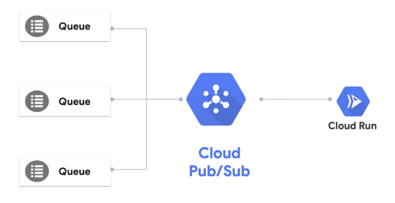

# Pub/Sub triggered service

So far, we deployed HTTP triggered public services. However, this is not the only way to trigger Cloud Run services. In this tutorial, let's see how a Cloud Pub/Sub message can trigger an internal service. You can read more about this in Cloud Run [docs](https://cloud.google.com/run/docs/events/pubsub-push).



## Create a 'Event Display' service

Take a look at the service we already created in [event-display](../event-display) folder. It simply logs out the HTTP request body. We'll use it to display the received messages.

## Build the container

In folder where `Dockerfile` resides, build the container using Cloud Build and push it to Container Registry:

```bash
gcloud builds submit \
  --project ${PROJECT_ID} \
  --tag gcr.io/${PROJECT_ID}/event-display
```

## Deploy to Cloud Run

Note that we're deploying with `no-allow-unauthenticated` flag. We only want Pub/Sub to trigger the service:

```bash
gcloud beta run deploy \
  --image gcr.io/${PROJECT_ID}/event-display \
  --platform managed \
  --no-allow-unauthenticated
```

## Setup Pub/Sub to trigger Cloud Run

Create a Pub/Sub topic:

```bash
gcloud pubsub topics create cloudrun-topic
```

Create a service account:

```bash
gcloud iam service-accounts create cloudrun-pubsub-serviceaccount \
   --display-name "Cloud Run Pub/Sub Service Account"
```

Give service account permission to invoke Cloud Run:

```bash
gcloud beta run services add-iam-policy-binding event-display \
   --member=serviceAccount:cloudrun-pubsub-serviceaccount@${PROJECT_ID}.iam.gserviceaccount.com \
   --role=roles/run.invoker
```

Enable your project to create Cloud Pub/Sub authentication tokens:

```bash
gcloud projects add-iam-policy-binding ${PROJECT_ID} \
     --member=serviceAccount:service-${PROJECT_NUMBER}@gcp-sa-pubsub.iam.gserviceaccount.com \
     --role=roles/iam.serviceAccountTokenCreator
```

Create a Cloud Pub/Sub subscription with the service account:

```bash
gcloud beta pubsub subscriptions create cloudrun-topic-subscription --topic cloudrun-topic \
   --push-endpoint=${SERVICE_URL} \
   --push-auth-service-account=cloudrun-pubsub-serviceaccount@${PROJECT_ID}.iam.gserviceaccount.com
```

## Test the service

You can test the service by sending a message to the queue: 

```bash
gcloud pubsub topics publish cloudrun-topic --message "Hello World"
```

If you check the logs of the service in Cloud Run console, you should see the event:

```
Event Display received event: {"message":{"data":"SGVsbG8gV29ybGQ=","messageId":"849662793093263","message_id":"849662793093263","publishTime":"2019-11-12T16:12:51.296Z","publish_time":"2019-11-12T16:12:51.296Z"},"subscription":"projects/knative-atamel/subscriptions/cloudrun-topic-subscription"}
```

The message is base64 encoded under data:

```bash
echo SGVsbG8gV29ybGQ= | base64 -D

Hello World
```

## What's Next?

[Scheduled service](scheduled.md)
