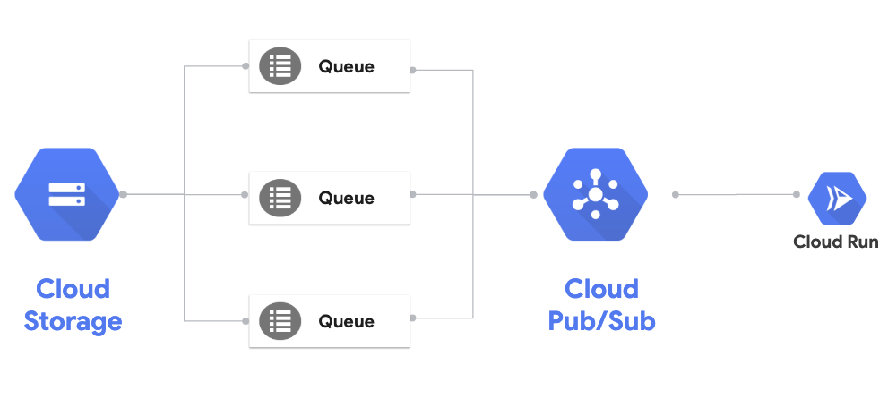

# Storage triggered service

In [Pub/Sub triggered service](pubsub.md) example, you can see how a Pub/Sub message triggers an internal Cloud Run service. This sample is similar, except the Pub/Sub message will be coming from Cloud Storage. 

[Cloud Storage](https://cloud.google.com/storage/docs/) is a highly scalable object storage. You can configure a Cloud Storage bucket to trigger a Pub/Sub message when there's an object upload. This Pub/Sub message can in turn be handled by a Cloud Run Service:



## Setup project variables

First, setup your project id and number that we'll need later:

```bash
export PROJECT_ID="$(gcloud config get-value core/project)"
export PROJECT_NUMBER="$(gcloud projects list --filter=${PROJECT_ID} --format='value(PROJECT_NUMBER)')"
```

## Create a 'Event Display' service

Take a look at the service we already created in [event-display](../event-display) folder. It simply logs out the HTTP request body. We'll use it to display the received messages.

## Build the container

In folder where `Dockerfile` resides, build the container using Cloud Build and push it to Container Registry:

```bash
gcloud builds submit \
  --project ${PROJECT_ID} \
  --tag gcr.io/${PROJECT_ID}/event-display
```

## Deploy to Cloud Run

Note that we're deploying with `no-allow-unauthenticated` flag. We only want Storage and then Pub/Sub to trigger the service:

```bash
export SERVICE_NAME=event-display-storage

gcloud run deploy ${SERVICE_NAME} \
  --image gcr.io/${PROJECT_ID}/event-display \
  --platform managed \
  --no-allow-unauthenticated
```

## Setup Pub/Sub to trigger Cloud Run

Create a Pub/Sub topic:

```bash
export TOPIC_NAME=cloudrun-storage

gcloud pubsub topics create ${TOPIC_NAME}
```

Create a service account:

```bash
gcloud iam service-accounts create ${TOPIC_NAME}-sa \
   --display-name "Cloud Run Storage Service Account"
```

Give service account permission to invoke the Cloud Run service:

```bash
gcloud run services add-iam-policy-binding ${SERVICE_NAME} \
   --member=serviceAccount:${TOPIC_NAME}-sa@${PROJECT_ID}.iam.gserviceaccount.com \
   --role=roles/run.invoker \
   --platform managed
```

Enable your project to create Cloud Pub/Sub authentication tokens:

```bash
gcloud projects add-iam-policy-binding ${PROJECT_ID} \
     --member=serviceAccount:service-${PROJECT_NUMBER}@gcp-sa-pubsub.iam.gserviceaccount.com \
     --role=roles/iam.serviceAccountTokenCreator
```

Create a Cloud Pub/Sub subscription with the service account:

```bash
export SERVICE_URL="$(gcloud run services list --platform managed --filter=${SERVICE_NAME} --format='value(URL)')"

gcloud beta pubsub subscriptions create ${TOPIC_NAME}-subscription --topic ${TOPIC_NAME} \
   --push-endpoint=${SERVICE_URL} \
   --push-auth-service-account=${TOPIC_NAME}-sa@${PROJECT_ID}.iam.gserviceaccount.com
```

## Create a bucket and enable notifications

Create a Cloud Storage bucket to store files:

```bash
export BUCKET_NAME=cloudrun-bucket

gsutil mb gs://${BUCKET_NAME}
```

Enable Pub/Sub notifications on the bucket and link to the previously created topic:

```bash
gsutil notification create -t ${TOPIC_NAME} -f json gs://${BUCKET_NAME}
```

## Test the service

You can test the service by saving a file to the bucket: 

```bash
echo "Hello from Storage" > random.txt

gsutil cp random.txt gs://${BUCKET_NAME}
```

Check the logs of the service in Cloud Run console, you should see the Cloud Event for the storage event:

```
2019-11-28 14:20:31.756 GMT Event Display received event: {"message":{"attributes":{"bucketId":"cloudrun-bucket","eventTime":"2019-11-28T14:20:30.345244Z","eventType":"OBJECT_FINALIZE","notificationConfig":"projects/_/buckets/cloudrun-bucket/notificationConfigs/1","objectGeneration":"1574950830345472","objectId":"random.txt","payloadFormat":"JSON_API_V1"},"data":"...","messageId":"795659161806846","message_id":"795659161806846","publishTime":"2019-11-28T14:20:30.859Z","publish_time":"2019-11-28T14:20:30.859Z"},"subscription":"projects/knative-atamel/subscriptions/cloudrun-storage-subscription"}
```

## What's Next?

[Scheduled service](scheduled.md)
