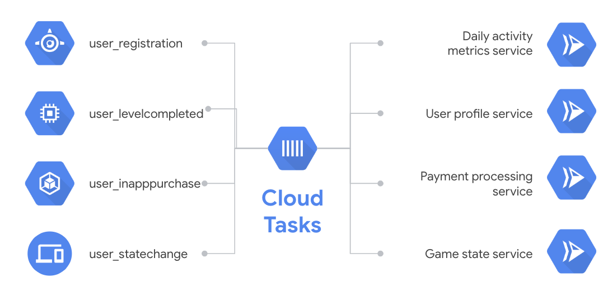

# Task triggered service

You can use [Cloud Tasks](https://cloud.google.com/tasks/) for async task execution with useful features such as task de-duplication, rate and retry controls, future scheduling and more. You can read more in Cloud Tasks [docs](https://cloud.google.com/tasks/docs/). The following blog posts are also useful in understanding use cases for Cloud Tasks:

* [Asynchronous Code Execution with Google Cloud Tasks](https://medium.com/google-cloud/asynchronous-code-execution-with-google-cloud-tasks-9b73ceaf48c3) by Grant Timmerman.
* [Cloud Tasks is a little stateful](https://medium.com/google-cloud/cloud-tasks-is-a-little-stateful-7ef39aad7d00) by Adam Ross.

You can use Cloud Run as an HTTP target handler for Cloud Tasks: 



## Enable Cloud Tasks

First, make sure the Cloud Tasks API is enabled in your project:

```bash
gcloud services enable cloudtasks.googleapis.com
```

## Create a 'Event Display' service

Take a look at the service we already created in [event-display](../event-display) folder. It simply logs out the HTTP request body. We'll use it to display the received messages.

## Build the container

In folder where `Dockerfile` resides, build the container using Cloud Build and push it to Container Registry:

```bash
gcloud builds submit \
  --project ${PROJECT_ID} \
  --tag gcr.io/${PROJECT_ID}/event-display
```

## Deploy to Cloud Run

Note that we're deploying with `no-allow-unauthenticated` flag. We only want Cloud Tasks to trigger the service:

```bash
export SERVICE_NAME=event-display-tasks

gcloud run deploy ${SERVICE_NAME} \
  --image gcr.io/${PROJECT_ID}/event-display \
  --platform managed \
  --no-allow-unauthenticated
```

## Setup Cloud Tasks to trigger Cloud Run

Create a service account:

```bash
export SERVICE_ACCOUNT=cloudrun-tasks-sa

gcloud iam service-accounts create ${SERVICE_ACCOUNT} \
   --display-name "Cloud Run Tasks Service Account"
```

Give service account permission to invoke the Cloud Run service:

```bash
gcloud run services add-iam-policy-binding event-display-tasks \
   --member=serviceAccount:${SERVICE_ACCOUNT}@${PROJECT_ID}.iam.gserviceaccount.com \
   --role=roles/run.invoker
```

## Create a task queue

Create a Cloud Tasks queue:

```bash
export QUEUE_NAME=cloudrun-queue

gcloud tasks queues create ${QUEUE_NAME}
```

## Create a task

You can create tasks programmatically or using gcloud. Here, we'll use gcloud for simplicity. Make sure you replace the url with your own Cloud Run service url you deployed earlier:

```bash
export SERVICE_URL="$(gcloud run services list --platform managed --filter=${SERVICE_NAME} --format='value(URL)')"

gcloud tasks create-http-task --queue ${QUEUE_NAME} \
  --url ${SERVICE_URL} \
  --body-content "Hello World from Cloud Tasks" \
  --oidc-service-account-email=${SERVICE_ACCOUNT}@${PROJECT_ID}.iam.gserviceaccount.com \
  --oidc-token-audience=${SERVICE_URL}
```

## Test the service

You can check the logs of the service to see that it's been triggered by the Cloud Tasks:

```
2019-11-28 09:55:09.946 GMT Event Display received event: Hello World from Cloud Tasks
```